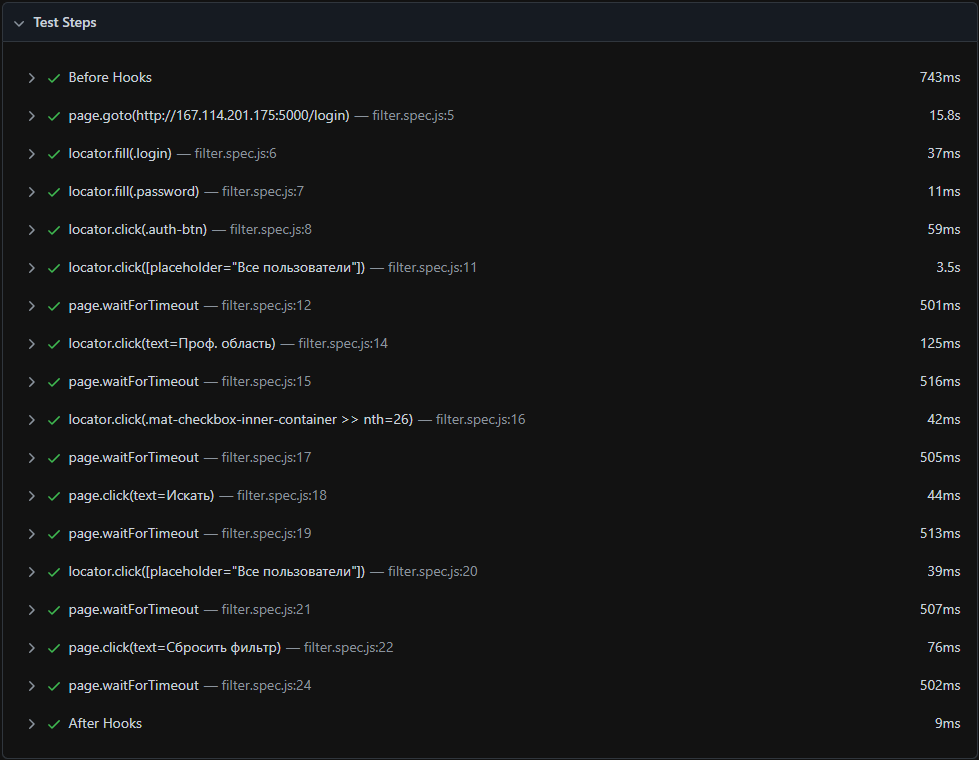

# autotest_qa_mid
    hello my name is Raiymbek, is this my attempt to do testing or something
    
    if you want to test this on your hardware. I recommend that you first 
    watch the tutorial on YouTube , for example:

    https://youtu.be/mLKXEEpuO00
    https://youtu.be/dQw4w9WgXcQ
---
    if you want to try this library you can follow this link https://playwright.dev/docs/intro
---
    command to run - npx playwright test <name of file>
    file name - filter.spec.js

        Example:
    npx playwright test filter.spec.js

    LOGS

